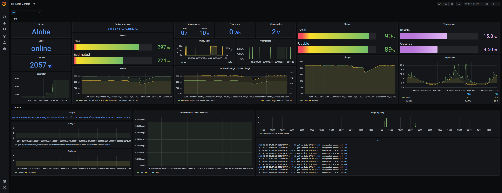

# Tesla Prometheus Exporter

Export Tesla vehicle metrics to Prometheus.

## Getting started

To get started, [generate the OAuth 2.0 credentials](#generate-credentials).
Container images are pushed to the GitHub container registry, and tagged by
release version. See the
[latest release](https://github.com/uhthomas/tesla_exporter/releases/latest).

The OAuth 2.0 config and token must be provided, which can be configured with
`--oauth2-config-path` and `--oauth-token-path`.

```sh
docker run \
  -v "$(pwd)/oauth2_config.json":/etc/secret/oauth2_config.json \
  -v "$(pwd)/oauth2_token.json":/etc/secret/oauth2_token.json \
  ghcr.io/uhthomas/tesla_exporter \
  --oauth2-config-path=/etc/secret/oauth2_config.json \
  --oauth2-token-path=/etc/secret/oauth2_token.json
```

## Generate credentials

Clone [uhthomas/tesla](https://github.com/uhthomas/tesla) and login with the
[cmd/login](https://github.com/uhthomas/tesla/tree/master/cmd/login) tool.

```sh
git clone git@github.com:uhthomas/tesla
cd "$(basename \"$_\")"
bazel run //cmd/login -- --username=hello@tesla.com --passcode=123456
```

The tool will ask for a password and print the JSON encoded
[oauth2 config](https://pkg.go.dev/golang.org/x/oauth2#Config) and
[oauth2 token](https://pkg.go.dev/golang.org/x/oauth2#Token) upon successful
authentication. Save the oauth2 config and token to new files named
`oauth_config.json` and `oauth2_token.json` respectively.

## Metrics

All metrics are labelled using the car's VIN. These are currently
non-exhaustive, as many more are planned to be added.

| Metric                                | API reference                       |
| :------------------------------------ | :---------------------------------- |
| tesla_vehicle_info                    | id, vehicle_id                      |
| tesla_vehicle_name                    | display_name                        |
| tesla_vehicle_state                   | state                               |
| tesla_vehicle_software_version        | vehicle_state.car_version           |
| tesla_vehicle_odometer_miles_total    | vehicle_state.odometer              |
| tesla_vehicle_inside_temp_celsius     | climate_state.inside_temp           |
| tesla_vehicle_outside_temp_celsius    | climate_state.outside_temp          |
| tesla_vehicle_battery_ratio           | charge_state.battery_level          |
| tesla_vehicle_battery_usable_ratio    | charge_state.usable_battery_level   |
| tesla_vehicle_battery_ideal_miles     | charge_state.battery_range          |
| tesla_vehicle_battery_estimated_miles | charge_state.est_battery_range      |
| tesla_vehicle_charge_volts            | charge_state.charger_voltage        |
| tesla_vehicle_charge_amps             | charge_state.charger_actual_current |
| tesla_vehicle_charge_amps_available   | charge_state.charger_pilot_current  |

## Preview

The metrics collected by Prometheus can be visualized through Grafana, and can
look something like the following.


